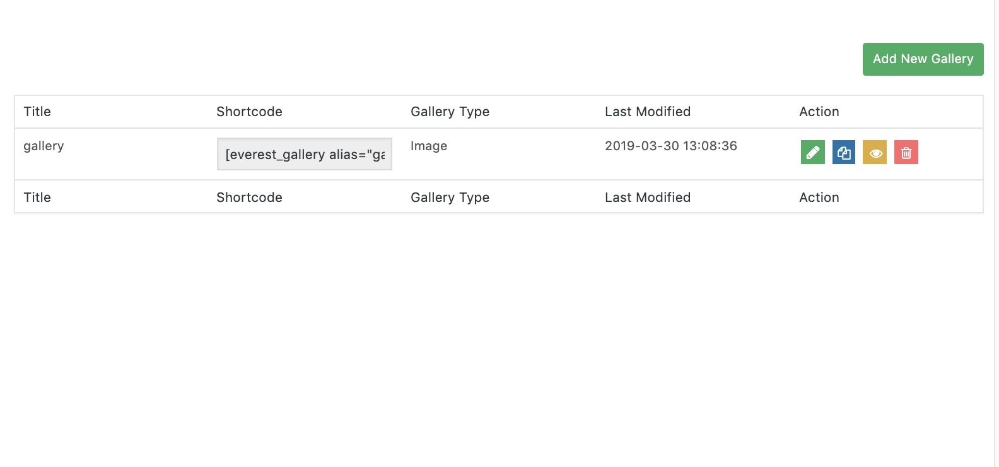
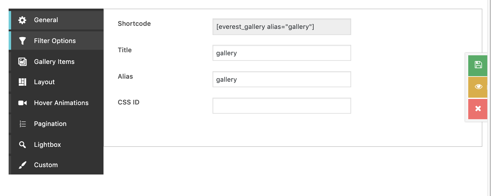
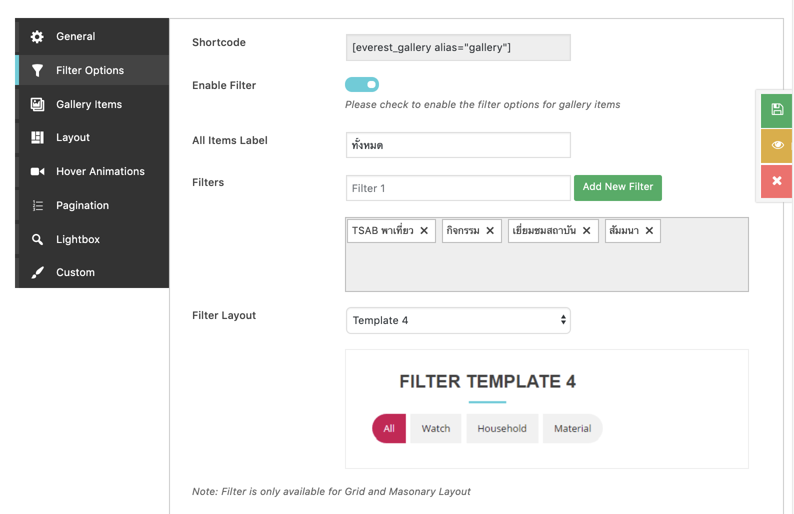
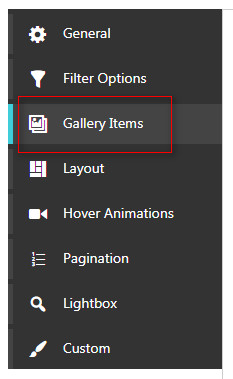
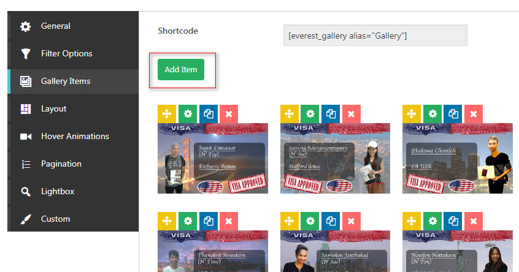
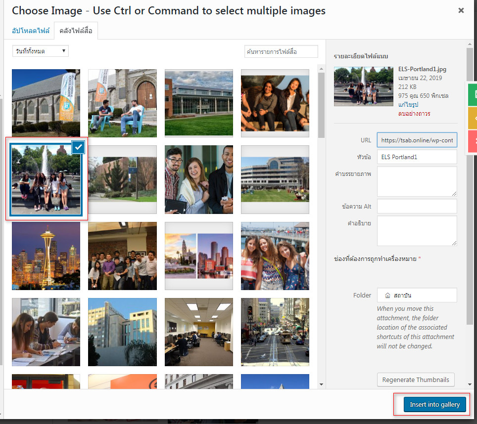
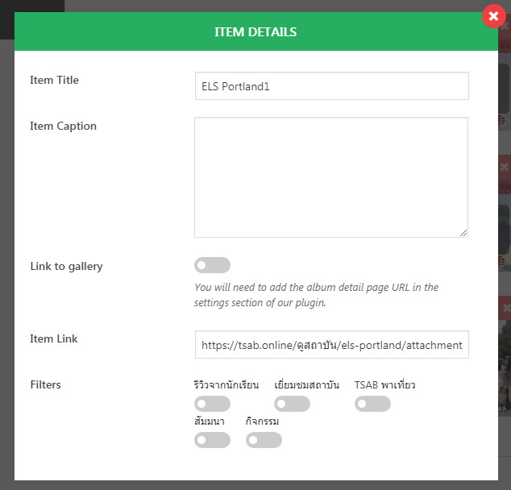
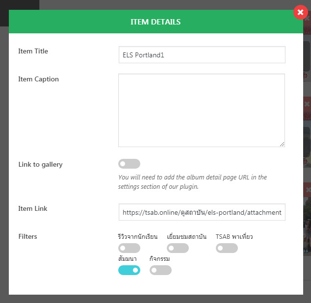
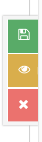

# การจัดการ Gallery

ไปที่เมนูแกลเลอรีคลิกที่เพิ่มใหม่


คลิกที่ปุ่มแก้ไข ICON ปากกา





ตั้งชื่อ Title และ Ailas






กำหนด Filter 





กด Add item ถ้าต้องการเพิ่มรูปจากในอัลบั้ม













```
กด Save ปุ่มสีเขียวด้านข้าง
```



