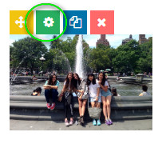

# การจัดการ Gallery

ไปที่เมนูแกลเลอรีคลิกที่เพิ่มใหม่


คลิกที่ปุ่มแก้ไข ICON ปากกา




ตั้งชื่อ Title และ Ailas




กำหนด Filter 




กด Add item ถ้าต้องการเพิ่มรูปจากในอัลบั้ม






```
กด Save ปุ่มสีเขียวด้านข้าง
```


