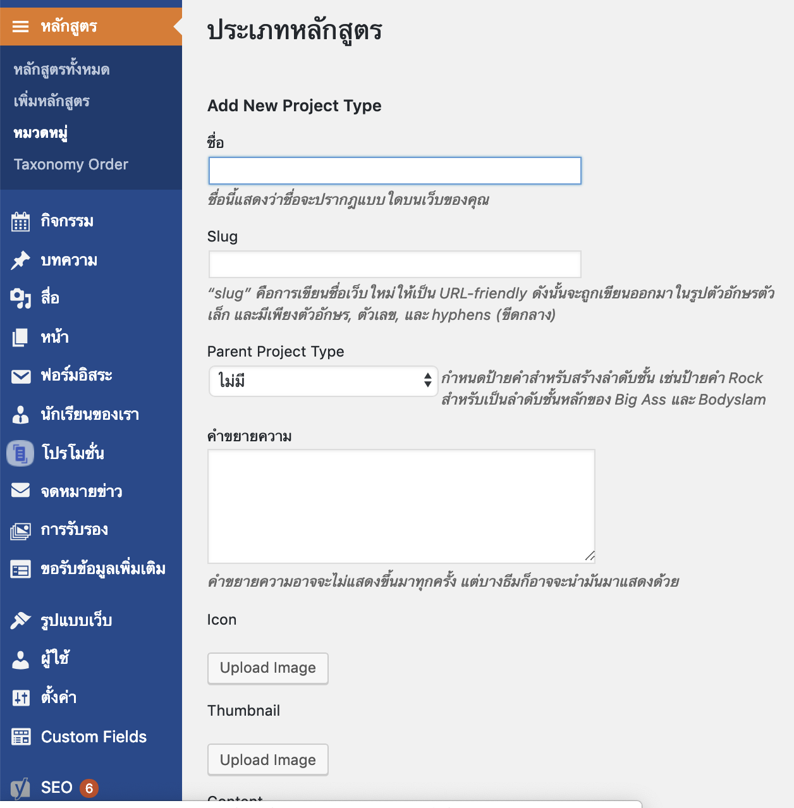
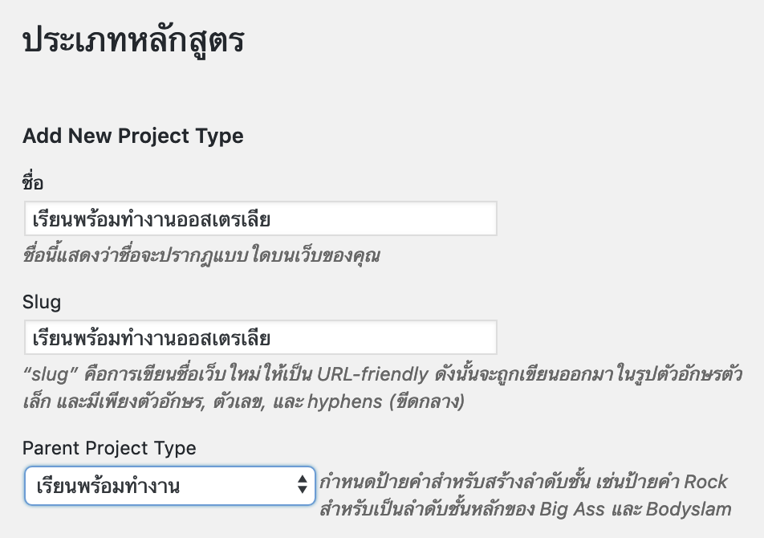
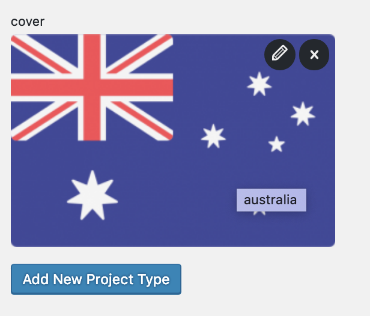

# การเพิ่มประเภทหลักสูตร

การเพิ่มประเภทหลักสูตรใหม่ กดปุ่ม หมวดหมู่ ตรงเมนูหลักสูตรด้านซ้ายอันที่ 3 

รายละเอียดที่ต้องใส่

1. ใส่ชื่อประเภทหลักสูตร
2. ใส่ Slug \(url\)
3. เลือหมวดหมู่หลักถ้าหมวดหมู่ที่จะสร้างเป็นหมวดหมู่ที่อยู่ใต้หมวดหมู่หลัก
4. ใส่ภาพหน้าปกที่ช่อง Cover ด้านล่างสุด
5. กด Add new project 

