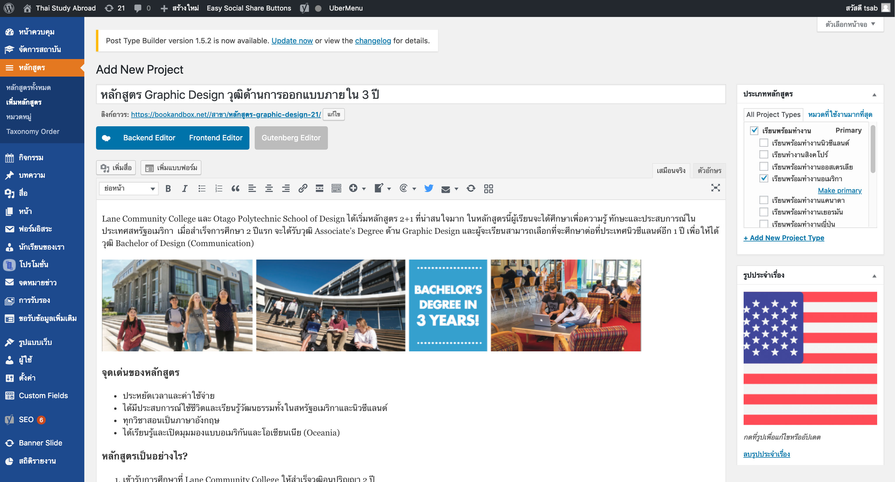

# การเพิ่มหลักสูตร

การเพิ่มหลักสูตรใหม่ กดปุ่ม [Add new](https://bookandbox.net/wp-admin/post-new.php?post_type=portfolio)

1. ใส่ชื่อหลักสูตร
2. ใส่รายละเอียดหลักสูตร
3. เลือกหมวดหมู่หลักและหมวดหมู่ย่อย \(ตามภาพ\)
4. ใส่ภาพหน้าปก
5. กดเผยแพร่

