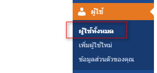
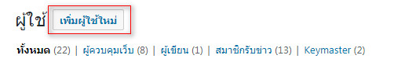
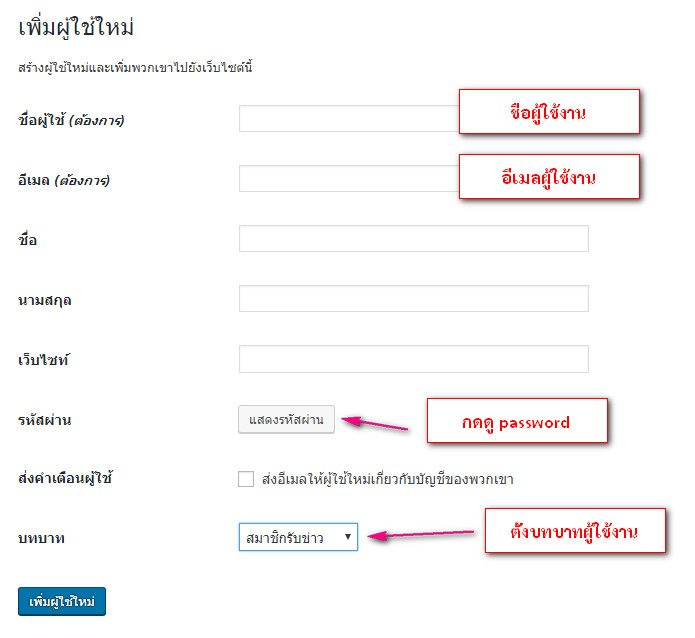
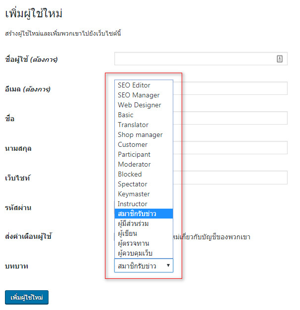

# การสร้าง User ใหม่

### เพิ่มผู้ใช้งานในระบบ

ให้เรากดปุ่ม add new จากลิสต์ผู้ใช้งานได้เลยครับ จากนั้นเราจะมาสู่หน้า เพิ่มผู้ใช้งานครับ จากนั้น ให้เรากรอกข้อมูลที่จำเป็นเข้าไปได้เลยครับ ซึ่งได้แก่

1\) ชื่อผู้ใช้งาน  
2\) อีเมลล์  
3\) Role

ในที่นี่เราจะกำหนดบทบาทให้ ผู้ใช้คนใหม่ เป็นผู้เขียนนะครับ

แล้วก็จะมีให้เรา Set Password หรือจะให้ WordPress สร้างให้ก็ได้ครับ นอกจากนั้นเรายังเลือกได้ว่า เมื่อสร้างเสร็จแล้ว จะให้ WordPress ส่งเมลล์ไปให้ผู้ใช้งานหรือเปล่าด้วยนะครับ

ผู้ใช้ที่เพิ่มนี้จะตั้งค่าบทบาท \(Role\) ได้หลายแบบ ดังนี้

1. สมาชิกรับข่าว \(Subscriber\) ทำอะไรไม่ได้ แค่เปลี่ยนข้อมูลส่วนตัวกับรหัสผ่าน
2. ผู้สนับสนุน \(Contributor\) สามารถส่งเรื่องเข้ามาได้ แต่ไม่สามารถกดเผยแพร่ได้ \(ประมาณ นักเขียนจากทางบ้าน\)
3. ผู้เขียน \(Author\) สามารถเขียนเรื่องใหม่ได้ แก้ไขเรื่องของตัวเองได้ แต่ไปยุ่งกับเรื่องของคนอื่นไม่ได้
4. ผู้ตรวจทาน \(Editor\) หรือบรรณาธิการ สามารถแก้ไขเนื้อหาของทุกคนได้ แต่ไม่สามารถปรับแต่งเกี่ยวกับเว็บไซต์ได้ \(เช่นเข้าหน้าเปลี่ยนธีม, ปลั๊กอิน ไม่ได้\)
5. ผู้ควบคุมเว็บ \(Administrator\) มีสิทธิสูงสุด แก้ได้ทุกอย่าง

แต่ในรูป ลงปลั๊กอิน WooCommerce ทำให้มีบทบาทเพิ่มอีก 2 แบบ คือ

1. Shop Manager หรือผู้จัดการร้าน สามารถเข้ามาแก้ไขเกี่ยวกับข้อมูลสินค้าได้
2. Customer หรือลูกค้า คือ ผู้ใช้ที่เคยซื้อสินค้าผ่านระบบ

ส่วนใหญ่เวลาเพิ่มคนช่วยจัดการเนื้อหา ก็มักจะเพิ่มอยู่ 2 แบบครับ คือ Author กับ Editor

หากอยากอ่านคู่มือเต็มๆ ดูที่ [Codex: Roles and Capabilities](https://codex.wordpress.org/Roles_and_Capabilities) ได้เลยครับ

