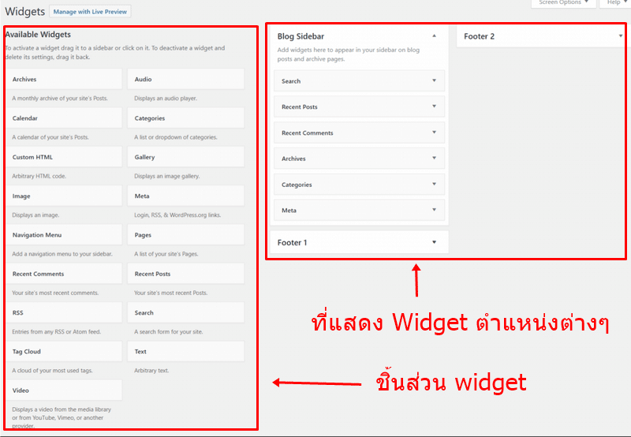
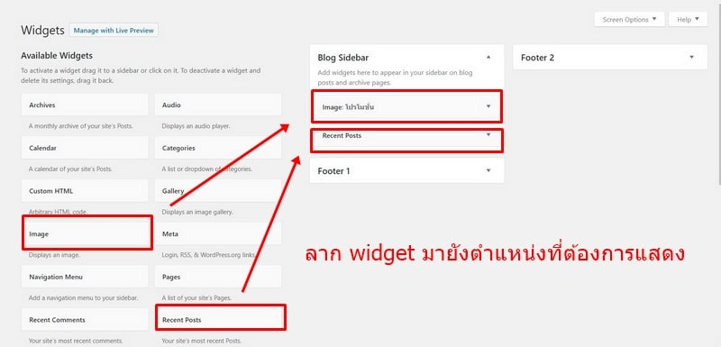

# การจัดการวิดเจ็ต

กลับไปหลังบ้าน &gt; ไปที่ Appearance &gt; คลิก Widget เราจะพบการแสดงผลหน้าตาแบบนี้

Widget คือ ชิ้นส่วนต่างๆ ที่แสดงอยู่ใน 2 แถว ด้านซ้ายมือ ส่วน 2 แถวด้านขวามือ เราเรียกว่าช่องที่เก็บ widget เพื่อให้แสดงผลที่หน้าเว็บ

