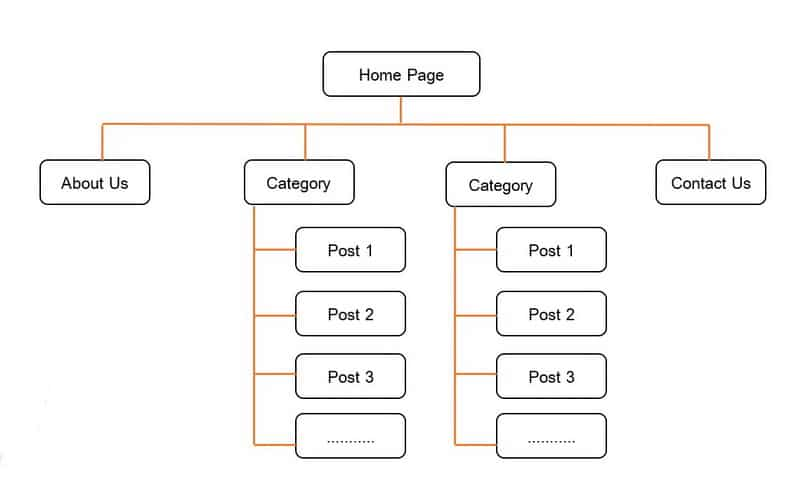
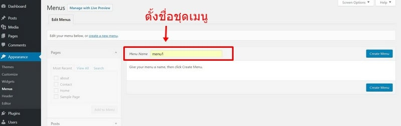
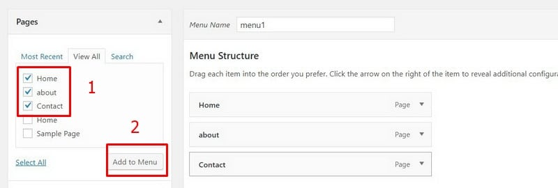
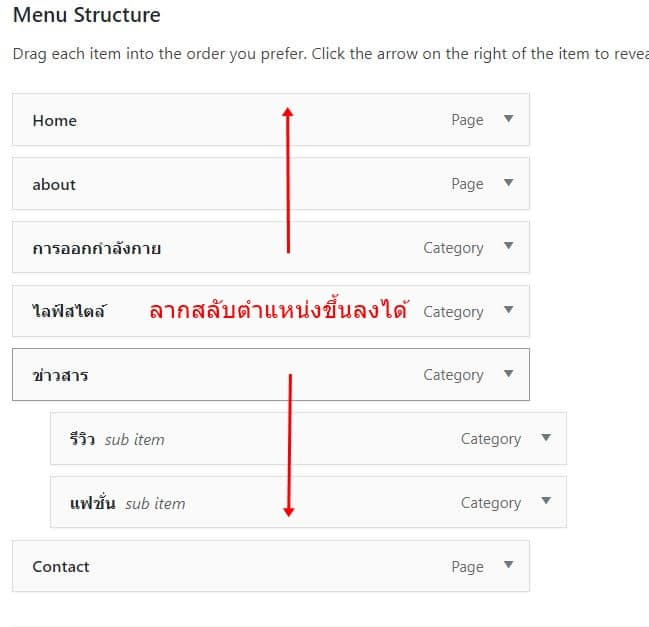
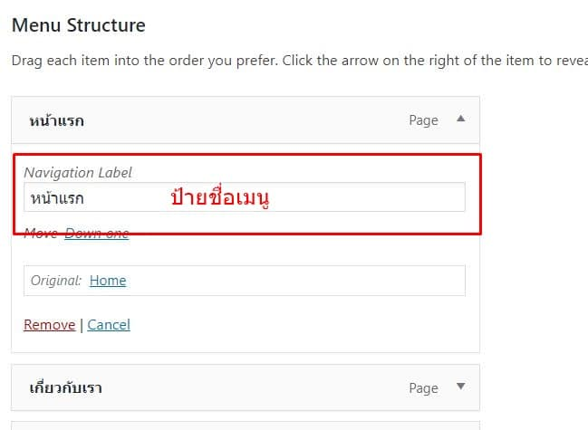
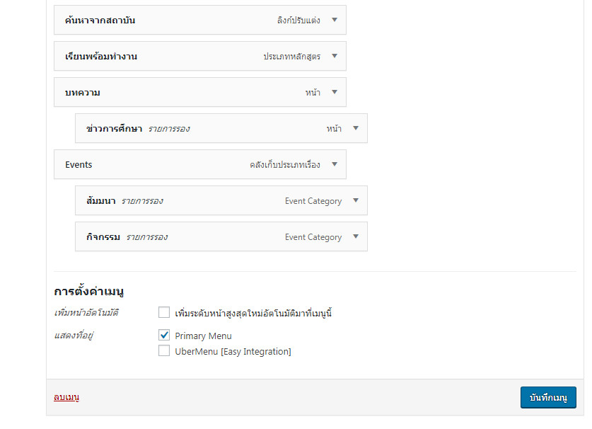

# การจัดการเมนู

กลับไปหลังบ้าน &gt; ไปที่ Appearance &gt; menu &gt; ตั้งชื่อเรียกชุดเมนู &gt; คลิก Create Menu

นอกจากนี้เรายังสามารถเลื่อนลำดับการแสดงเมนูว่าต้องการให้ใครมาก่อน มาหลัง ด้วยการ Drag & Drop ได้เลย รวมถึงหากเราต้องการให้เมนูไหน เป็น sub menu ของใคร เราก็ลากเมนูนั้นให้อยู่ใต้ของตัวเมนูที่เราต้องการได้เลยครับ

นอกจากนี้เรายังสามารถเปลี่ยน Navigation Label \(ป้ายชื่อเมนู\) เป็นคำที่เราต้องการก็ได้ โดยให้เราคลิกตรงมุมขวาที่เป็นลูกศรเล็ก บนแถบเมนู แล้วเข้าไปเปลี่ยนป้ายชื่อเมนูได้เลย

เนื่องจากใน 1 เว็บไซต์ในความเป็นจริงแล้ว เราสามารถสร้างชุดเมนูกี่อันก็ได้ ดังนั้นเมื่อเราสร้างเมนูเสร็จ เราต้องเป็นคนกำหนด location \(ที่ตั้งของเมนู\) ว่าจะให้เมนูนี้อยู่ตำแหน่งไหนบนเว็บของเรา ตามตัวอย่างให้เราติ๊กเลือกที่ Primary Menu ครับ

