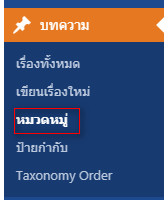
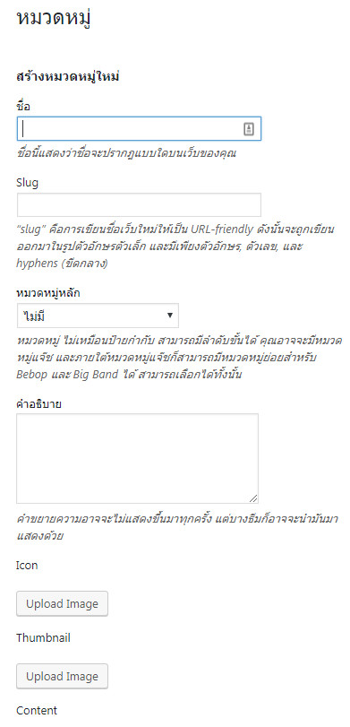
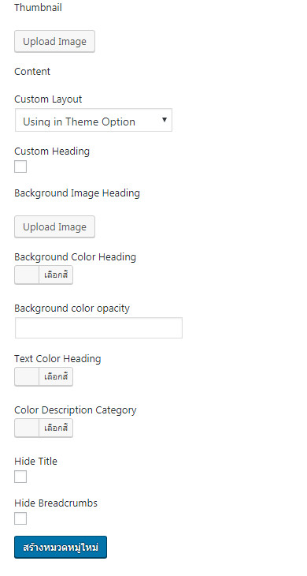

# การเพิ่มหมวดหมู่

**Name:** ใส่ชื่อหมวดหมู่ จะใช้ภาษาไทย หรือภาษาอังกฤษก็ได้

**Slug:** คือ URL ที่จะแสดงหน้าเว็บ ตรงจุดนี้ แนะนำให้ เขียนเป็นภาษาอังกฤษ เท่านั้น

หมวดหมู่หลัก คือ การกำหนดให้หมวดหมู่ที่กำลังสร้างนี้ จะให้เป็นหมวดหมู่หลัก หรือ เป็นหมวดหมู่ย่อย

เมื่อใส่ข้อมูลเสร็จ คลิก **Add New Category/สร้างหมวดหมู่ใหม่** ให้เรียบร้อย ทำซ้ำจนกว่าเราจะได้ครบทุกหมวดหมู่ที่เราต้องการ

