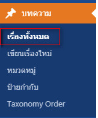
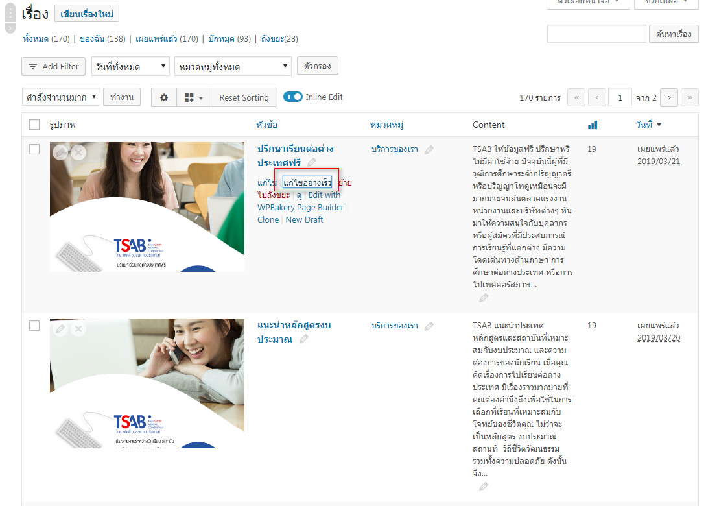
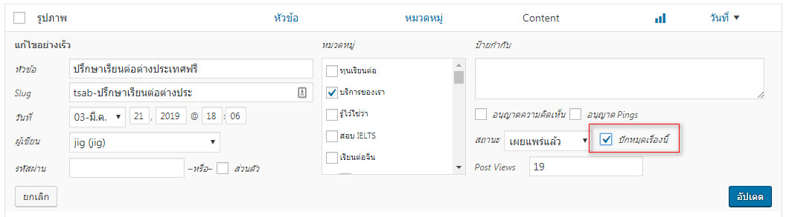

# การปักหมุด

เพื่อทำให้บทความนั้นๆ เรียงมาเป็นอันดับแรกๆ ในหน้ารวมบทความ

1.ไปที่ **บทความ &gt; เรื่องทั้งหมด** 

2.เลือก บทความที่ต้องการปักหมุด แล้วไปที่ **แก้ไขอย่างเร็ว**

3.ติ๊กถูก **ปักหมุดเรื่องนี้** เสร็จแล้วกด **อัปเดต**

