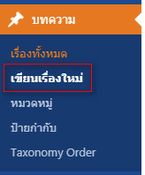
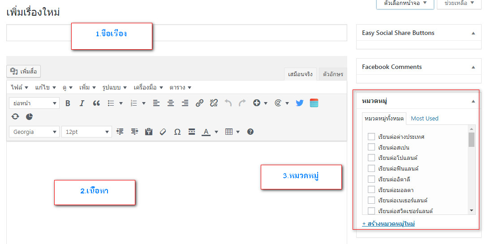
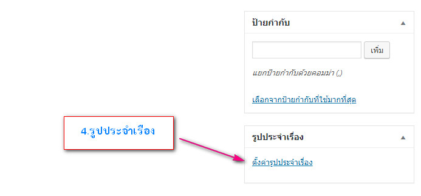

# การเพิ่มบทความ

ไปที่ **บทความ &gt; เขียนเรื่องใหม่** จากนั้นให้ใส่เนื้อหาของบทความลงไป

#### ในทุก ๆ Post ต้องมี 4 สิ่งนี้ คือ

1. ชื่อเรื่อง
2. Categories \(หมวดหมู่\)
3. เนื้อหา
4. Featured image \(รูปภาพหน้าปก\)

และใน 1 Post สามารถอยู่ในหลาย Categories ได้

และใน 1 Post สามารถอยู่ในหลาย Categories ได้

