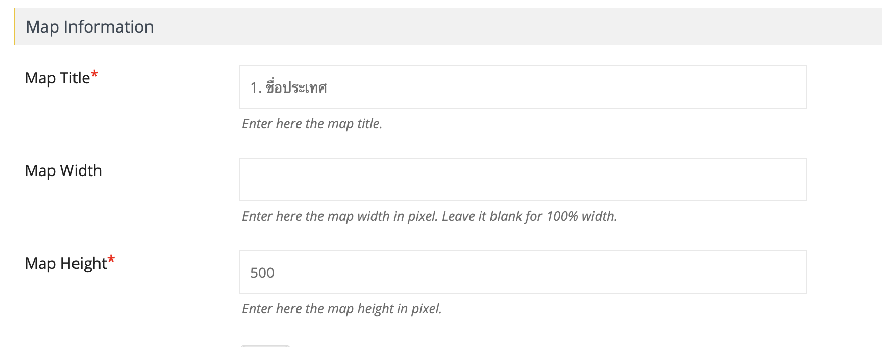
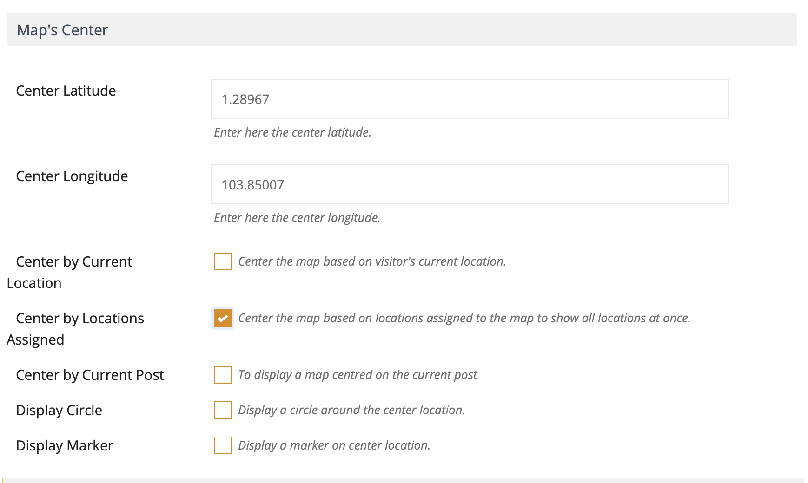

# การสร้างแผนที่

ไปที่เมนู **แผนที่** ด้านซ้าย

## Short code ประเทศ

| ประเทศ | Map Short-code |
| :--- | :--- |
| Singapore | \[put\_wpgm id=47\] |
| Australia  | \[put\_wpgm id=7\] |
| Canada | \[put\_wpgm id=25\] |
| China  | \[put\_wpgm id=40\] |
| Finland | \[put\_wpgm id=43\] |
| France | \[put\_wpgm id=26\] |
| Germany | \[put\_wpgm id=27\] |
| Ireland | \[put\_wpgm id=28\] |
| Italy | \[put\_wpgm id=39\] |
| Japan | \[put\_wpgm id=33\] |
| Korea | \[put\_wpgm id=42\] |
| Malta | \[put\_wpgm id=41\] |
| Netherlands | \[put\_wpgm id=35\] |
| New zealand | \[put\_wpgm id=34\] |
| Poland | \[put\_wpgm id=45\] |
| Spain | \[put\_wpgm id=44\] |
| Switzerland | \[put\_wpgm id=29\] |
| UK | \[put\_wpgm id=36\] |
| USA | \[put\_wpgm id=24\] |
|  |  |


กด Copy แผนที่อื่น แล้วแก้ 3 อย่าง


1. ชื่อประเทศ
2. Center Latitude
3. Center Longitude


ค้นหา latlong ใน Google โดยพิมพ์ว่า  
Center latitude ตามด้วยชื่อประเทศนั้นๆ


