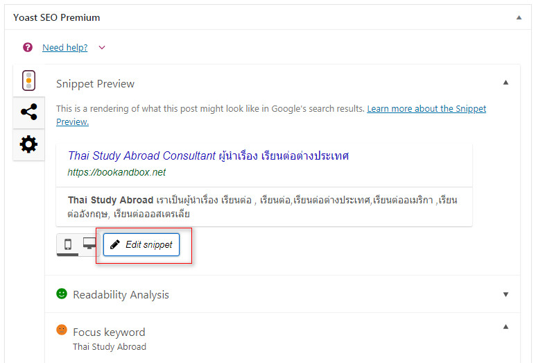
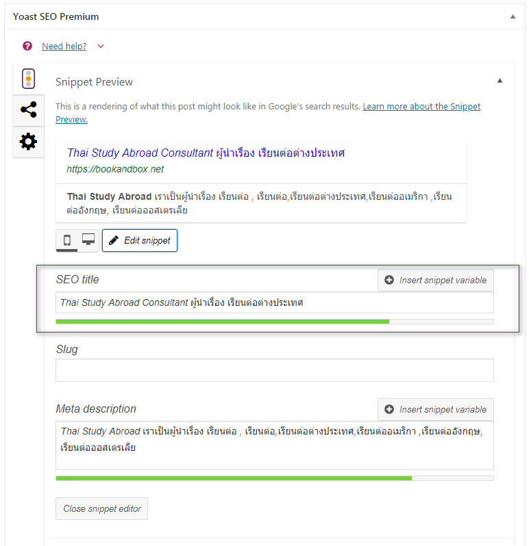
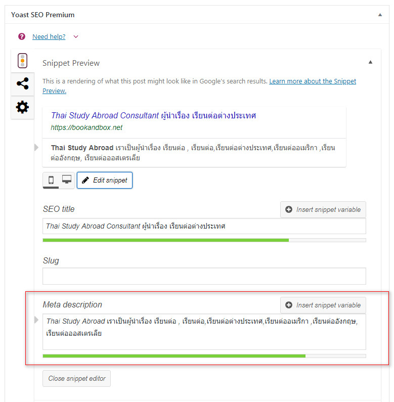
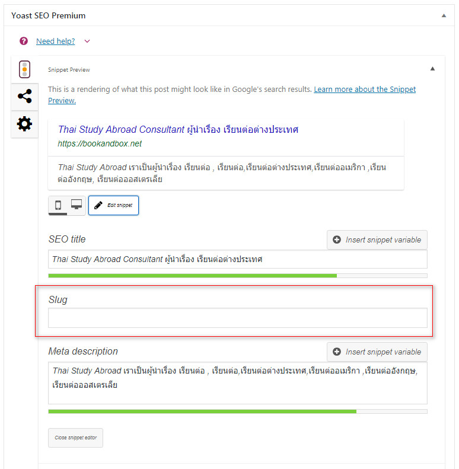

# การตั้งค่า Yoast SEO

#### ในทุกบทความ หรือในหน้าเพจบนเว็บของเรา ต้องโฟกัสไปที่เรื่องเดียว 1 หน้า 1 focus keyword อย่าพยายามยัด keyword ทุกอย่างลงไป

1. ให้เราใส่คำ keyword ที่เราได้เลือกไว้ ลงในช่อง Focus keyword

 2. เราควรตั้งชื่อเรื่องด้วยความยาวที่เหมาะสม ไม่สั้นหรือยาวเกินไป วิธีเช็คขนาดความยาวของชื่อเรื่อง ให้เราคลิกตรงคำว่า **Edit snippet**

* **ชื่อเรื่องบทความ ต้องไม่ยาวเกินไปหรือสั้นเกินไป และต้องมี Focus keyword รวมอยู่ด้วย**

*  **Meta description**  **ต้องมี Focus keyword รวมอยู่ด้วย**

*  **ตรงส่วนของ Slug คือ ส่วนกำหนด url ของบทความ ให้เราใส่คำ focus keyword ลงไปได้เลย**

